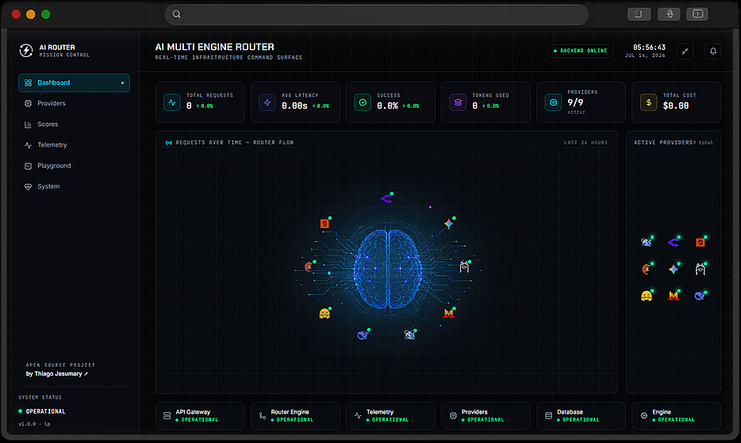

# 🧠 AI Multi-Engine Router

### Intelligent Multi-Provider AI Routing Infrastructure

Real-time telemetry • Automatic fallback • Provider scoring • Mission Control dashboard

An enterprise-grade open-source platform for routing AI requests across multiple providers, monitoring operational health in real time, and providing a unified Mission Control experience for observability and intelligent provider orchestration.

---

# ✨ Showcase

Explore the AI Multi-Engine Router through its real-time Mission Control interface.

---

### 🧠 Mission Control Dashboard




# Features

## Multi-Provider Routing

- Intelligent provider selection
- Task-based routing
- Provider abstraction layer
- Provider Registry
- Provider SDK
- Model Selector
- Router Engine
- Automatic fallback
- Extensible provider architecture

---

## Supported Providers

| Provider      | Integration |
| ------------- | ----------- |
| OpenRouter    | ✅           |
| Groq          | ✅           |
| Cerebras      | ✅           |
| Google Gemini | ✅           |
| Ollama        | ✅           |
| Hugging Face  | ✅           |
| DeepSeek      | ✅           |
| Nexum Runtime | ✅ Internal  |
| Mistral AI    | 🚧 Planned  |


---

## Mission Control Dashboard

Real-time dashboard built with Next.js.

Includes:

- Live Providers
- Provider Scores
- Telemetry
- Playground
- Health Monitor
- Backend Status
- Active Provider
- Selected Model
- Latency
- Automatic Polling
- Retry States
- Error Handling
- Internal Response Scroll
- Sci-Fi Interface

---

## Telemetry

The Router continuously records:

- Provider
- Model
- Task
- Latency
- Success
- Failure
- Automatic Fallback
- Request History

---

## Provider Scoring

Every provider receives a dynamic score based on:

- Latency
- Availability
- Success Rate
- Reliability

Designed to evolve into intelligent routing decisions.

---

## Automatic Fallback

Primary Provider
        │
        ▼
Secondary Provider
        │
        ▼
Fallback Provider
        │
        ▼
Nexum Runtime

No application interruption.

---

# Architecture

```text
                    Client

                       │

          Next.js Mission Control

                       │

                 REST API

                       │

                   FastAPI

                       │

                Router Engine

        ┌──────────┼──────────┐
        │          │          │

 Provider Selector  Model Selector

        │

  Automatic Fallback

        │

 Telemetry + Provider Scores

        │

 ┌─────────────────────────────────────┐

 OpenRouter
 Groq
 Cerebras
 Google Gemini
 Ollama
 Hugging Face
 DeepSeek
 Nexum Runtime

 └─────────────────────────────────────┘
```

---

# Project Structure

```text
AI-Multi-Engine-Router

app/
│
├── api/
├── core/
├── providers/
├── router/
├── telemetry/
├── schemas/
├── services/
└── main.py

dashboard/
│
├── app/
├── components/
├── public/
├── lib/
└── styles/

docs/

README.md
```

---

# Installation

## Clone

```bash
git clone https://github.com/thiagojesumary/ai-multi-engine-router.git

cd ai-multi-engine-router
```

---

# Backend

Install dependencies

```bash
uv sync
```

Run

```bash
uv run uvicorn app.main:app --reload
```

Swagger

```
http://127.0.0.1:8000/docs
```

---

# Dashboard

```bash
cd dashboard

npm install

npm run dev
```

Open

```
http://localhost:3000/lp
```

---

# Environment Variables

## Backend

```env
OPENROUTER_API_KEY=

GROQ_API_KEY=

CEREBRAS_API_KEY=

GEMINI_API_KEY=

HUGGINGFACE_API_KEY=

DEEPSEEK_API_KEY=

OLLAMA_BASE_URL=http://localhost:11434/v1
```

---

## Dashboard

```env
NEXT_PUBLIC_ROUTER_API_URL=http://127.0.0.1:8000
```

---

# API

## Health

```
GET /health
```

---

## Providers

```
GET /v1/providers
```

---

## Provider Scores

```
GET /v1/provider-scores
```

---

## Telemetry

```
GET /v1/telemetry
```

---

## Generate

```
POST /v1/generate
```

---

# Playground

1. Open Playground

2. Choose a task

or

Use one of the Quick Prompts

- Explain Telemetry
- Test Fallback
- Production Routing
- Generate LinkedIn Post
- Summarize Architecture

3. Click **Generate**

4. Observe:

- Selected Provider
- Selected Model
- Latency
- Fallback
- Response

---

# Available Tasks

- General
- Analysis
- Summarization
- Generation
- Reasoning

Each task can be routed to a different provider and model.

---

# Current Stack

## Backend

- Python
- FastAPI
- Pydantic
- HTTPX
- Uvicorn

---

## Frontend

- Next.js
- React
- TypeScript
- TailwindCSS
- Framer Motion
- Lucide React

---

# Roadmap

## v1.0

- Multi-provider routing
- Mission Control Dashboard
- Playground
- Telemetry
- Provider Scores
- Automatic Fallback
- Health Monitoring

---

## v1.1

- Provider Identity
- Provider Notifications
- Provider Analytics
- Better Dashboard Visualizations

---

## v1.2

- Additional Providers
- Local Models
- Intelligent Model Selection
- Cost Optimization

---

## v1.3

- Provider Intelligence
- Historical Metrics
- Reliability Reports
- Performance Trends

---

## v1.4

- Advanced Telemetry
- Event Timeline
- Alerts
- AI Routing Insights

---

# Contributing

Contributions are welcome.

Feel free to open Issues and Pull Requests.

---

# License

MIT License

---

# Author

## Open Source Project

Created by **Thiago Jesumary**

LinkedIn

https://www.linkedin.com/in/thiago-jesumary/

GitHub

https://github.com/thiagojesumary

---

## If this project helped you

⭐ Star the repository.

It helps the project reach more developers and supports future improvements.
